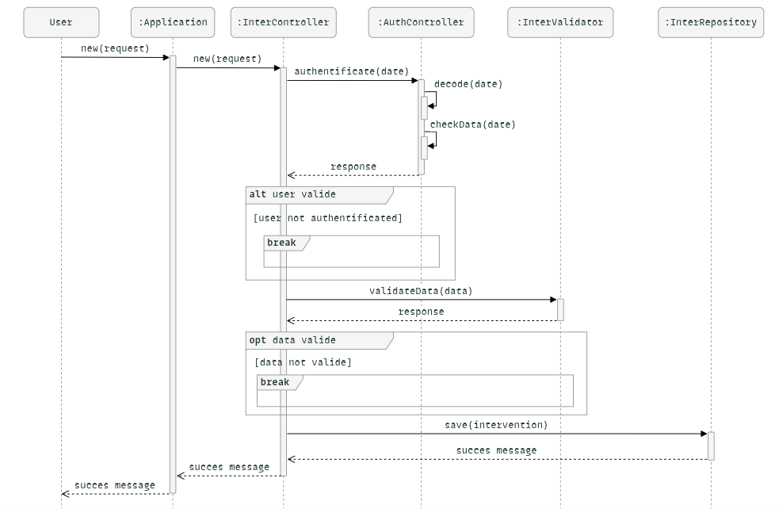
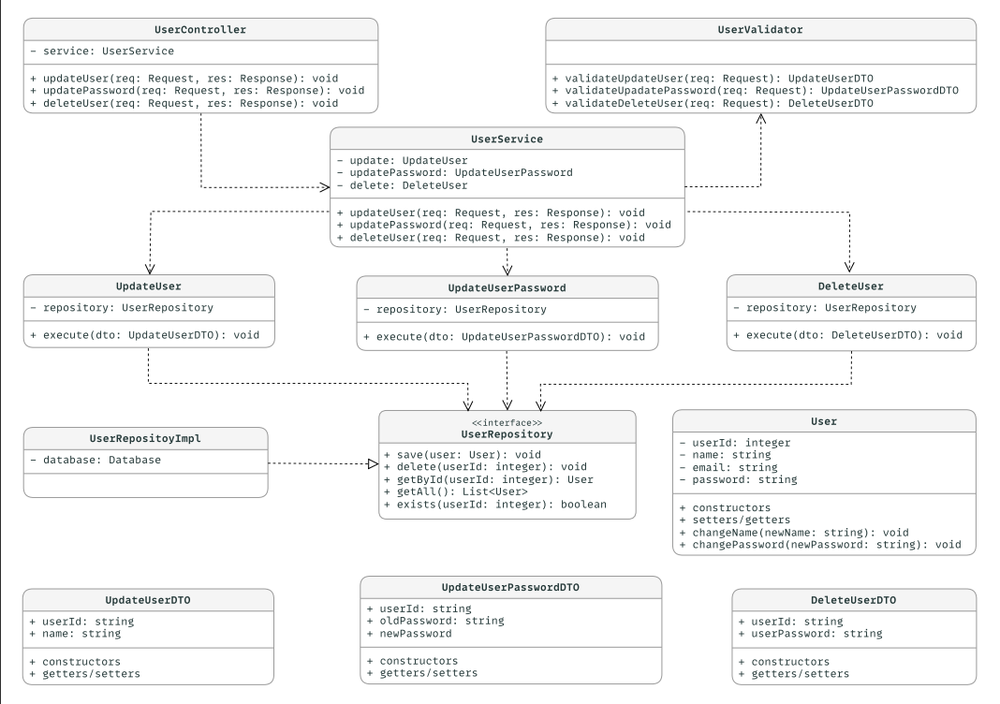
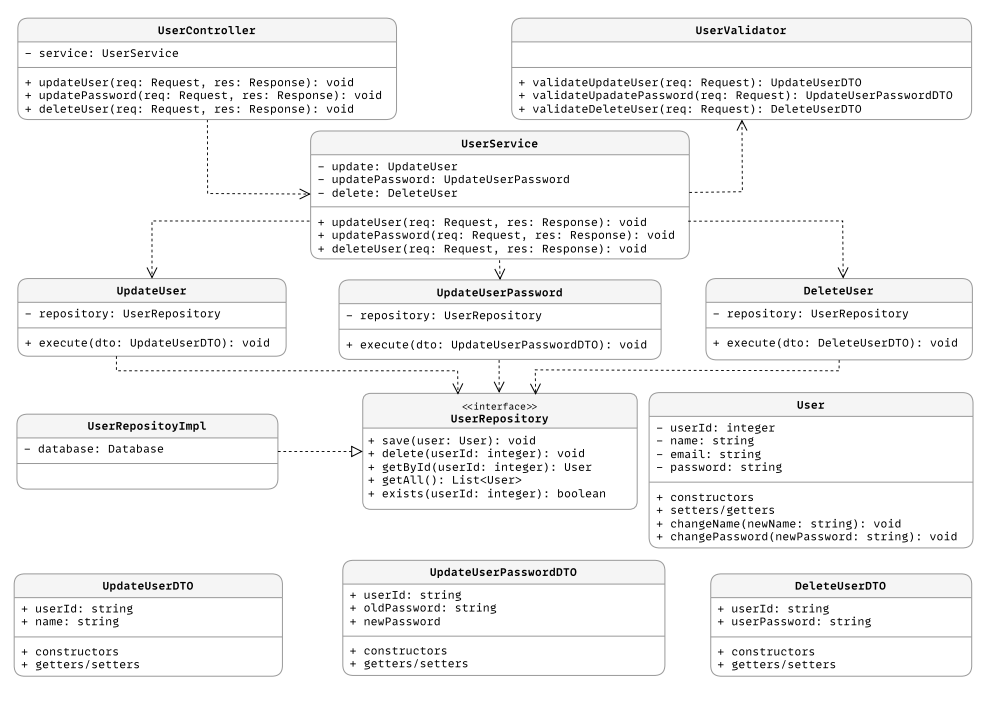

    
# Diagramme de Séquence

Voici le diagramme de séquence de notre système :

Voici le diagramme de classe de notre système :

ds

c 
# Use Case – Create Task

## 📄 Identifier
**Code**: `CT1`  
**Name**: *Create Task*  
**Date**: 24/06/2025  
**Version**: 1.0  

## 🎯 Description
The user wants to add a new task by providing a title, a duration (e.g., 2h30min), and a scheduled time.  
The system stores this task and displays it in the user's dashboard.

## 👤 Actors
- **Primary**: User  
- **Secondary**: None

## ✅ Preconditions
- The user must be authenticated.

## 🎯 Postconditions

### ✔️ Success
- The new task is saved to the database.  
- The dashboard is updated to include the new task.  
- A success message is shown to the user.

### ❌ Failure
- The task is not saved.  
- An error message is displayed.  
- The user remains on the task creation interface.

## 🔁 Scenarios

### 🔹 Basic Flow
1. The user clicks on the **"New Task"** button.  
2. The system displays the **task creation form**.  
3. The user fills in the **title**, **duration**, and **scheduled time**.  
4. The user clicks **"Save"**.  
5. The system **validates the input**.  
6. The system **adds the task to the database**.  
7. The dashboard **refreshes** and a **success message** is shown.

### 🔸 Alternative Flow
**Step 5 – Validation failure**:  
- If the provided data is invalid (e.g., empty title, incorrect time format),  
- The system displays an **error message** and keeps the **form visible** for correction.

### 🔻 Exception Flow
- If the user accesses the creation URL **without being authenticated**,  
- The system detects the **missing session** and **redirects to the login page**.

